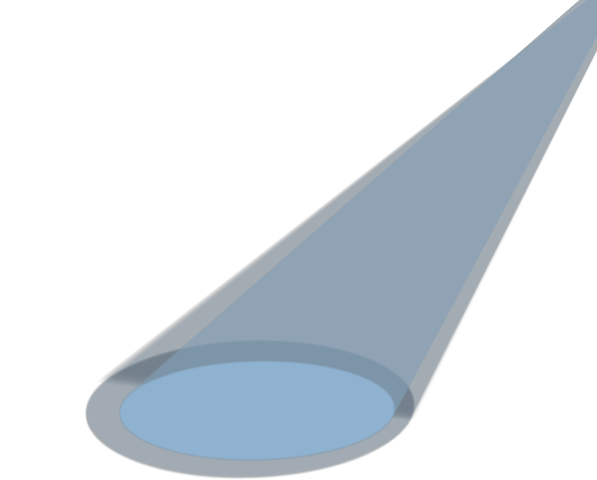
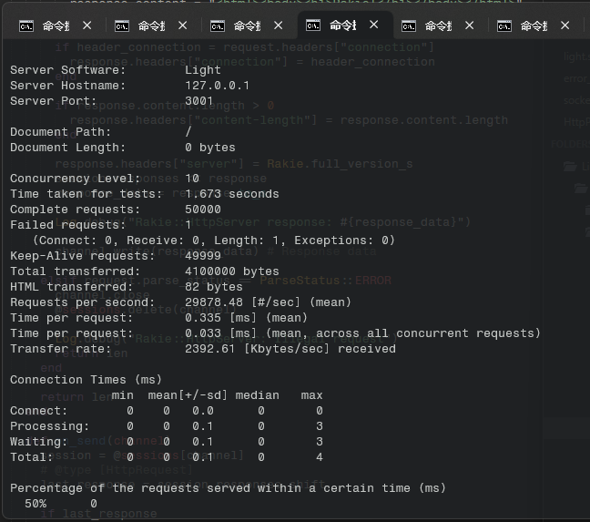
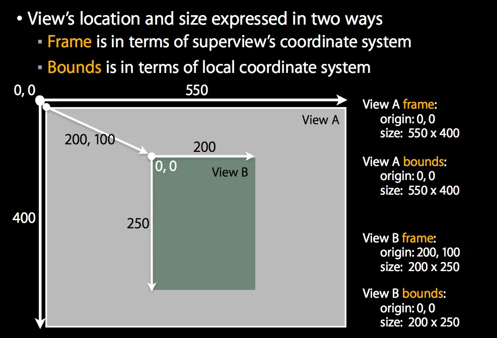

# 灯.lua

> 若我即是彼方，光明坦荡

`灯` 的目标是面向 Lua **全知全能** 的通用标准库，为 Lua 开发者们提供基础设施。

你可以用它来写 Android App，写 Windows 电脑游戏，写网站写后台，写你想写的任何东西。

## 简介

`灯` 目前有 6 个模块：

- **对象** 提供面向原型的编程基础类
- **记录** 提供 ORM 基础能力
- **协作** 提供协程与事件机
- **日志** 提供基本日志输出
- **套接** 提供跨平台的套接字功能，与少量加解密方法。
- **网络** 提供 Http 与 WebSocket 网络通信能力，和 TCP 基础能力。
- **图形** 提供与 Love2d 兼容的图形 API，开发跨平台移动与桌面应用，甚至娱乐游戏。

### 能力展示

网络性能



## 安装

> luarocks install Light

### 依赖库

#### SQLite3

> luarocks install lsqlite3

面向数据库读写的 **记录** 模块 `light.record` 基于 `lsqlite3` 但不会自动安装它.

您可以通过上面的命令安装，但安装时会提示您 系统要先装一个 SQLite3

所以，系统层安装 SQLite3 数据库可以这样:

- 在 Ubuntu 系统上命令 `apt get install libsqlite3-dev` 安装.
- Windows 系统, 您可以找个别人编好的的包，或者自己拉 SQLite3 源码自己用 Visual Studio 编译.

## 对象

> light.Object -> Object

以最适合 Lua 语言的链式结构设计，提供高性能的方法调用与 JavaScript 同类特征特性。

示例代码：

```lua
local Object = require('light.Object')

local Base = Object()

-- Tips:
-- You can also do like this
--
-- local Base = {}
-- Object(Base)
--
-- or
--
-- local Base = Object({})

local b = Base()

print(b:instanceOf(Base))
print(b.proto == Base)

-- Make Derived inherit from Base
local Derived = Object(Base)

-- Tips:
-- You can also do like this
--
-- local Derived = {}
-- Object(Base, Derived)

local d = Derived()

print(d:instanceOf(Derived)) -- Will print "true"
print(d.proto == Derived)    -- Will print "true"
print(d:instanceOf(Base))    -- Will print "true"
print(d.proto == Base)       -- Will print "true"
```

## 记录

> light.Record -> Record

记录是 数据库的 ORM 模块，充当 MVC / MVVM 当中 Model 的角色

使用 Record 即可获得跟 `SQLAlchemy` 或 `ActiveRecord` 同等特性。

简而言之，**记录** 是个数据库的 **增删改查** 库

增删改查示例：

```lua
local u = Users() -- 创建条目
u.name = 'demo'..i
u.age = i
print('User.save', u, u:save(), u.id)

u:save() -- 增：写入条目

local found = Users:findOne({ -- 查：根据条件查找
  id = 1
})

found.age = 100

found:update() -- 改：提交修改

found:destroy() -- 删：删除条目
```

### 设备

> light.Device -> Device

设备提供可扩展性的接口，方便用户接入其它数据存储 DBC 接口实现为驱动

## 协作

> light.Worker -> Worker

以 `Lua` 协程 `rotoutine` 为基础结合 `对象.lua` 实现的接口类

用户可

### 事件机

> light.worker.EventWorker -> EventWorker

以跨平台套接字 `light.socket` 结合 **协程** 实现的协作类。

等同于 `libevent` 和 `libuv`，提供用于 IO 异步事件处理。

## 日志

> light.Log -> Log

示例代码：

```lua
Log.level = Log.Level.DEBUG

Log:info('Hi,', 'here is themessage')
Log:warningF('warning %d', 123)
Log:error('error')
Log:debug('debug')
```

## 套接

提供跨平台的套接字支持：

- Windows
- Linux
- macOS
- iOS

### TCP

> light.socket.TCP -> TCP

示例代码：

```lua
local s = light.socket.TCP()
s:connect('localhost', 8080)
```

### UDP

> light.socket.UDP -> UDP

**尽快提供 UDP 方面的支持**

### Base64

#### 加密

> light.socket.base64encode -> fun(string)

#### 解密

> light.socket.base64decode -> fun(string)

### SHA1

> light.socket.sha1 -> fun(string)

### SHA1Hex

> light.socket.sha1hex -> fun(string)

## 网络

### 频道

#### TCP 频道

> light.network.channel.TCPChannel -> TCPChannel

TCP 频道为最基本的 TCP 消息发送管道，用户可通过下列方式操作：

- TCPChannel:connect('host', port)
- TCPChannel:connectNow('host', port) -- 非阻塞连接
- TCPChannel:read(1024)
- TCPChannel:readNow(1024) - 非阻塞读
- TCPChannel:write('buffer', 6)
- TCPChannel:writeNow('buffer', 6) - 非阻塞写
- TCPChannel:close()

#### TCP 服务频道

> light.network.channel.TCPServerChannel -> TCPServerChannel

TCP 频道为 TCP 服务类应用的管道，用户可通过下列方式操作：

- TCPChannel:accept()
- TCPChannel:acceptNow() -- 非阻塞接纳
- TCPChannel:close()

### 协议

> light.protocol

基于状态机的数据交换协议分析接口，支持 **序列化** 以及 **反序列化**

#### HTTP 1.1 协议

> light.network.protocol.HttpProtocol -> HttpProtocol

按 Http 1.1 协议标准实现，提供状态信息属性：

- statusCode
- statusMessage
- method
- path
- headers
- content

提供 MIME 类：

> HttpProtocol.MIME

#### WebSocket 13 协议

> light.network.protocol.WebsocketProtocol -> WebsocketProtocol

按 WebSocket 13 协议标准实现，提供状态信息属性：

- fin
- mask
- masking -- 掩码
- length
- payload -- 消息主体
- ...

### 会话

会话使用 **基于协程** 的 **事件机** 实现 IO 异步，并提供委托 `delegate` 接口与 函数接口便于用户使用。

#### TCP 会话

> light.network.session.TCPSession -> TCPSession

#### TCP 服务会话

> light.network.session.TCPServerSession -> TCPServerSession

#### Http WebSocket 聚合会话

> light.network.session.HttpSession -> HttpSession

提供 Http 与 WebSocket 聚合的客户端类

用户可直接使用，通过设置委托 `delegate` 回调即可快速建立 **基于事件** 的客户端应用

示例代码：

```lua
local HttpSession = require('light.network.session.HttpSession')
local WebSocketProtocol = require('light.network.protocol.WebSocketProtocol')

local s = HttpSession('127.0.0.1', 8080, function (action, ...)
  print('action:', action)
  if action == 'onHttp' then
    --- @type HttpSession, HttpProtocol, HttpProtocol
    local self, input, output = ...
    output.headers['connection'] = input.headers['connection']
    return output

  elseif action == 'onWebSocket' then
    --- @type HttpSession, WebSocketProtocol, WebSocketProtocol
    local self, input, output = ...
    print('onWebSocket:', input.payload)
  end

  return nil
end)

s:sendHandShake() -- Upgrade to websocket

local count = 1
local t1 = os.time()

while true do
  local t2 = os.time()
  s:resume() -- Polling

  if t2 - t1 > 5 then
    t1 = t2
    count = count + 1

    local request = WebSocketProtocol()
    request.mask = true
    request.opCode = WebSocketProtocol.OpCode.OP_TEXT
    request.payload = string.format("Hello <%d> times", count)
    s:send(request)
  end
end
```

#### Http WebSocket 聚合服务会话

> light.network.session.HttpServerSession -> HttpServerSession

使用 Http WebSocket 聚合服务会话可快速开发 高性能后端类 应用。

示例代码：

```lua
local Log = require('light.log')

local HttpServerSession = require('light.network.session.HttpServerSession')

local s = HttpServerSession('127.0.0.1', 3001, 200, function (action, ...)
  -- print('action:', action)
  if action == 'onHttp' then
    --- @type HttpSession, HttpProtocol, HttpProtocol
    local self, input, output = ...
    return output
  end

  return nil
end)

while true do
  s:resume() -- Polling
end
```

## 图形

图形库 需要你额外 安装 Love2d 并布置环境。

部署方式：

最不用思考的方式是 直接下载 非安装版本，解压，把里面的可执行文件与 dll、 全部拖到根目录，即可启动。

`D:\路径...\love.exe .` 注意尾巴是 空格 + `.`（点）

### 坐标设计

`light.graphics` 采用与移动端 布局一致的 坐标体系：



### 基本

#### 平面向量

> light.graphics.Vector2

包含 `x` 和 `y` 坐标

#### 三维向量

> light.graphics.Vector3

包含 `x`、 `y` 和 `z` 坐标

#### 四维向量

> light.graphics.Vector4

包含 `x`、 `y`、 `z` 以及 `w` 坐标

#### 字体管理

> light.graphics.FontManager

用于加载字体，使用字体

- 加载：`FontManager['字体名称'] = '字体路径'`
- 使用：`local font = FontManager['字体名称'][字号]`

#### UI 事件

> light.graphics.Event

用于绑定 UI 视图事件，例如点击 `onMouseUp`

须实现接口 `EventDelegate`

### 图层

#### 画布图层

> light.graphics.layer.CanvasLayer

类似于 iOS `CALayer`，用于作图

#### 图像图层

> light.graphics.layer.ImageLayer

加载图片与展示

#### 文本图层

> light.graphics.layer.TextLayer

支持多色彩显示的文本图层

### 控件

#### 按钮

> light.graphics.view.ButtonView

按钮控件

#### 标签

> light.graphics.layer.LabelView

标签控件，可设置字体

## 命名规范

### 变量

```lua
local var_name = 123 -- 小写

local varName = 123 -- 小写
```

### 类型

```lua
-- 枚举
local DataType = {
  TEXT,  
  NUMBER,
  TEXT_AND_NUMBER
}

local MyClass = {} -- 大写

function MyClass:new()
  self.dataSize = 123 -- 驼峰命名，对象属性
end

function MyClass:getData( ... ) -- 驼峰命名，对象方法
  -- body
end

function MyClass:StaticMethod( ... ) -- 首字大写驼峰命名，静态方法
  -- body
end

-- 静态属性
MyClass.DataType = DataType -- 首字大写驼峰命名，对象静态属性
```

### 包（命名空间）

> 包就是 目录，理解上为 命名空间

```
C:/name_space_a/name_space_b/...
```

#### 类

> 类文件名 以驼峰形式

这是 `MyClass.lua` 类:

```lua
local MyClass = {}

function MyClass:new( ... )
  -- body
end

return MyClass
```

#### 模块

> 模块就是 没有类，纯粹的 `table` 放一些工具函数

这是 `my_module.lua` 模块：

```lua
local my_module = {}

my_module.TestCallA = function ( ... ) -- 工具方法会导出，所以大驼峰
  -- body
end

function my_module.TestCallB( ... ) -- 同上
  -- body
end

return my_module
```

### 函数

局部函数：

```lua
local function my_function() -- 局部函数，不暴露不导出，小写
  -- code
end

local function MyFunction() -- 局部函数，导出，大驼峰
  -- code
end

return {
  MyFunction = MyFunction
}
```

全局函数：

```lua
function MyFunction() -- 全局静态函数，大驼峰
  -- code
end
```

## 版权

此模块以 `BSD 2-Clause License` 协议发行，请遵守规矩！

著作权归 **Jakit Liang 泊凛** 所有

